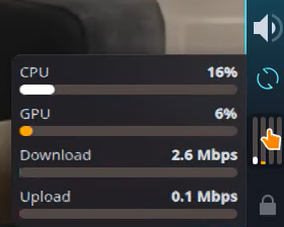

# CPU & Network Speed Widget

[](https://kde.org/plasma-desktop/)
[](https://doc.qt.io/qt-6/qtqml-index.html)
[](https://github.com/PlasmaDrifter)
[](LICENSE)

A compact, real-time CPU utilization and network throughput monitor for KDE Plasma 6.

---

## Previews




---

## Features

- **Real-time**: CPU percentage monitoring and multi-core status
- **Live**: network download and upload speed gauges
- **Transparent**: background blending into any wallpaper or panel
- **Compact**: layout suited for desktop or panel placement

## Requirements

- **Environment**: KDE Plasma 6.0 or higher
- **Framework**: Qt6 QML / Plasma Applet API

## Installation

### Option 1: Git Clone (Recommended)
```bash
mkdir -p ~/.local/share/plasma/plasmoids/
git clone https://github.com/PlasmaDrifter/cpu-net-speed.git ~/.local/share/plasma/plasmoids/local.widget.cpu-net-speed
```

### Option 2: Plasma Package Installer
```bash
kpackagetool6 -i ~/.local/share/plasma/plasmoids/local.widget.cpu-net-speed
```

Then right-click your desktop or panel $\rightarrow$ **Add Widgets...** and search for the widget name.

## Credits & License

- **Author / Maintainer**: PlasmaDrifter
- **License**: Licensed under the [GPLv2](LICENSE).
